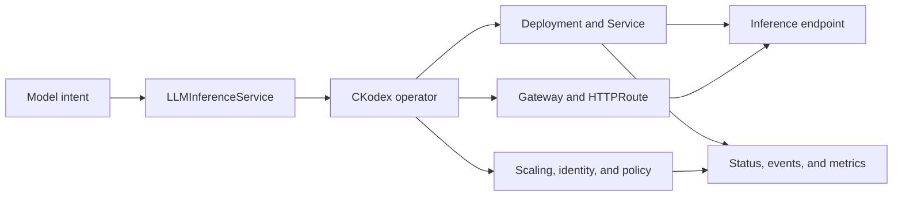

# CKodex KServe LLM Operator

[](https://goreportcard.com/report/github.com/ckodex-labs/ckodex-kserve-llm)
[](https://opensource.org/licenses/Apache-2.0)
[](docs/overview.md)
[](https://securityscorecards.dev/viewer/?uri=github.com/ckodex-labs/ckodex-kserve-llm)

The CKodex KServe LLM Operator turns model-serving declarations into
Kubernetes workloads, routing, scaling, identity, and observable status.

Start with **[the big picture](docs/overview.md)**. It explains the user roles,
runtime loop, resource map, and current product boundaries in one place.

## Who It Is For

| User | What they provide | What they receive |
|---|---|---|
| Model scientist | Model URI, model name, runtime resources, acceptance criteria | A reachable inference service with status and metrics |
| Platform developer | Kubernetes, storage, Gateway API, compute, policy, observability | A repeatable control plane for model-serving workloads |
| Security reviewer | Identity, network, and evidence requirements | Inspectable resources, conditions, OSCAL results, and release artifacts |

## How It Works



The custom resource is the desired-state contract. Controllers reconcile that
contract into Kubernetes resources. Status and telemetry report what actually
happened.

## Local Proof

Prerequisites: Docker, KIND, `kubectl`, Helm, `curl`, `jq`, and network access.

```bash
./run/e2e.sh
```

This creates or reuses a KIND cluster, installs the required local
dependencies, builds the operator and storage initializer, applies a
CPU-capable Qwen model, and probes `/v1/chat/completions`.

Inspect the result:

```bash
kubectl get llminferenceservices.serving.ckodex.com -A
kubectl get deployments,services,gateways,httproutes -A
kubectl get events -A --sort-by=.lastTimestamp
```

Clean up:

```bash
./run/cleanup.sh
```

See [Getting Started](docs/getting-started.md) for the scientist and platform
developer paths.

## Primary API

Use `serving.ckodex.com/v1` for new `LLMInferenceService` resources that stay
within the stable surface. Specialized CRDs and some extended fields remain
`v1alpha2`; check the generated CRD before choosing a version.

```yaml
apiVersion: serving.ckodex.com/v1
kind: LLMInferenceService
metadata:
  name: qwen-small
  namespace: default
spec:
  model:
    name: qwen-0.5b
    uri: hf://Qwen/Qwen2.5-0.5B-Instruct
  replicas: 1
  template:
    spec:
      containers:
        - name: vllm
          resources:
            limits:
              cpu: "4"
              memory: 8Gi
  router:
    gateway:
      managed:
        gatewayClassName: envoy
    route:
      httpRoute: {}
    scheduler:
      pool: {}
```

Use the maintained manifests in [`config/samples/`](config/samples/) and
[`local/04-llm-inference-service.yaml`](local/04-llm-inference-service.yaml)
as executable examples.

## Scope

Core controllers cover:

- LLM, embedding, ASR, multimodal, and reranker inference services
- Gateway API routing and scheduler resources
- autoscaling, LoRA adapters, model caching, and evaluation profiles
- AIPack artifact metadata and governance status
- model onboarding readiness and Prometheus-backed gates

Optional subsystems such as SPIFFE/SPIRE, webhooks, auth, sessions, and
experimental agents depend on feature gates and cluster services.

`Agent` and `SkillRegistry` currently validate references and readiness. They
do not execute tools or provide an agent invocation runtime. See
[Agent Development](docs/agent-development.md).

## Verification

```bash
dagger call all --source=.       # hosted fast gate: lint + compile
dagger call test --source=.      # race tests + coverage gates
dagger call scan --source=.      # image vulnerability scan
dagger call lula --source=. export --path=assessment-results.yaml
```

The Dagger functions use dependency and tool cache boundaries so repeated local
runs reuse unchanged work. Tagged GitHub releases remain the authoritative
hosted path for published artifacts and provenance.

## Documentation

| Goal | Document |
|---|---|
| Understand the product | [Big Picture](docs/overview.md) |
| Run a local deployment | [Getting Started](docs/getting-started.md) |
| Onboard or promote a model | [Model Onboarding](docs/onboarding-guide.md) |
| Plan model capacity | [Model Capacity](docs/model-capacity.md) |
| Configure tenants | [Tenant Onboarding](docs/tenant-onboarding.md) |
| Review security controls | [Security Architecture](docs/SECURITY_ARCHITECTURE.md) |
| Verify releases | [Release Verification](docs/release-verification.md) |
| Inspect component versions | [Component Inventory](COMPONENTS.md) |
| Contribute | [Contributing](CONTRIBUTING.md) |

## Project Status

- Chart metadata: `v0.18.0-beta.5`
- Core LLM API: stable `serving.ckodex.com/v1`
- Specialized APIs: `serving.ckodex.com/v1alpha2` where no v1 CRD exists
- Core model-serving path: enabled
- Experimental agent controllers: disabled by default
- Security and admission integrations: opt-in and dependency-sensitive

Do not infer API stability from the number of available CRDs. Check feature
gates, controller registration, and the relevant runbook before adopting an
optional subsystem.

## License

Apache License 2.0
