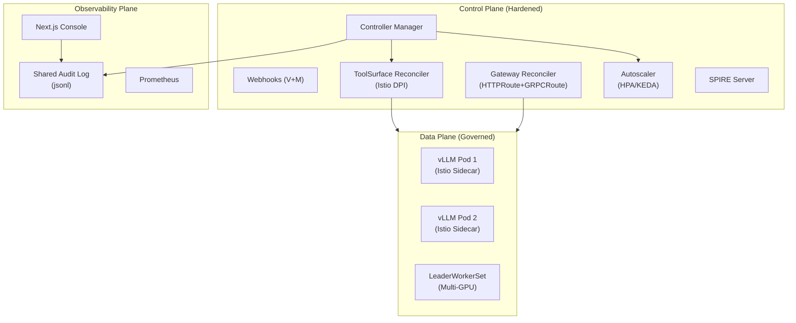

# CKodex KServe LLM Operator

[](https://goreportcard.com/report/github.com/ckodex-labs/ckodex-kserve-llm)
[](https://opensource.org/licenses/Apache-2.0)
[](docs/getting-started.md)
[](https://securityscorecards.dev/viewer/?uri=github.com/ckodex-labs/ckodex-kserve-llm)

An opinionated Kubernetes operator for managing LLM inference workloads. Built on KServe v0.17 architecture with the V2 Open Inference Protocol, Gateway API (HTTPRoute + GRPCRoute), and comprehensive platform features.

- **[Component Version Inventory](COMPONENTS.md)**: Track exact versions of vLLM, SPIRE, Gatekeeper, and other orchestrated components.

## Architecture



> [!NOTE]
> For a deep dive into our defense-in-depth strategy, mTLS enforcement, and OPA policy layers, see the **[Security Architecture](docs/SECURITY_ARCHITECTURE.md)** guide.

## Production Hardening Features

### Governed State Planes (L|T|R)
The operator implements a **Governed Composite State Machine** that aggregates safety and compliance metadata across the model system:
- **Lifecycle (L)**: `pending` → `active` → `quarantined`. Tracks the operational readiness of the model.
- **Trust (T)**: `unknown` → `asserted` → `verified`. Cryptographically verified identity (SPIFFE) and network isolation (DPI).
- **Risk (R)**: `normal` → `evaluating` → `high`. Real-time risk assessment based on behavioral declared intent and tool usage.

### Deep Packet Inspection (DPI)
Models requiring external tool access (`ToolSurface.AllowedAPIs`) are isolated via **Istio Egress Filtering**:
- Automatic `ServiceEntry` and `VirtualService` generation for FQDN targets.
- Sidecar-level egress isolation prevents unauthorized data exfiltration.
- Moves the model trust state to **`verified`** upon successful DPI verification.

### Real-time Monitoring Console
A built-in Next.js dashboard provides a unified view of the governed fleet:
- **Lattice Visualization**: Real-time status of `L|T|R` state planes for every model.
- **Live Audit Feed**: Event-driven streaming of operator and inference decisions.
- **Shared Audit Plane**: Uses a high-performance persistent volume for real-time log ingestion.

### Verifiable Evidence (Proofs)
Unlike typical operators, we provide machine-readable "receipts" of our security posture:
- **OSCAL Assessment**: Automated validation of NIST 800-53 controls (SR-2, SI-4, SI-7) exported to **`assessment-results.yaml`**.
- **OIS Signal Payloads**: Standardized inference behavior telemetry using **Open Inference Signals v0.1**.
- **Supply-Chain Contract**: 100% SLSA-compliant builds with Cosign signatures and verifiable SBOMs.

See **[COMPLIANCE.md](COMPLIANCE.md)** for the full control mapping.

## Operational Guides
...

Comprehensive documentation for the lifecycle of models, tenants, and agents:

- **[Model Onboarding Guide](docs/onboarding-guide.md)**: From binary acquisition to production promotion.
- **[Model Offboarding Guide](docs/offboarding-guide.md)**: Graceful shutdown and finalizer cleanup.
- **[Tenant Onboarding Guide](docs/tenant-onboarding.md)**: Multi-tenancy, compliance silos, and isolation.
- **[Agent Development Guide](docs/agent-development.md)**: Using the Agent and SkillRegistry system.

## CRDs

| CRD                         | Purpose                                                       |
| --------------------------- | ------------------------------------------------------------- |
| `LLMInferenceService`       | Core workload: model, replicas, parallelism, scaling, routing |
| `LLMInferenceServiceConfig` | Reusable config templates                                     |
| `EndpointPickerConfig`      | KV-cache scheduler plugin pipeline                            |
| `AgentSpec`                 | AI agent with model bindings and tools                        |
| `SkillRegistry`             | Versioned skill catalog                                       |
| `ModelOnboarding`           | Declarative model lifecycle pipeline                          |

## Quick Start

> [!IMPORTANT]
> For a clean installation on a fresh KIND cluster, refer to `local/` scripts for infrastructure prerequisites.

```bash
# 1. Setup KIND cluster
make kind-setup

# 2. Install Infrastructure (KServe v0.17, cert-manager, etc.)
# Note: uses OCI ghcr.io/kserve/charts/kserve-resources
cd local && bash 02-prereqs.sh && bash 03-kserve-helm-install.sh

# 3. Build & Deploy Operator
make generate manifests
make docker-build
docker tag ghcr.io/ckodex/kserve-llm-operator:latest ckodex/kserve-llm-operator:dev
kind load docker-image ckodex/kserve-llm-operator:dev --name kserve-017

# 4. Install CRDs (Server-side apply recommended for large schemas)
for f in config/crd/*.yaml; do kubectl apply --server-side -f "$f"; done

# 5. Deploy Operator
kubectl apply -f config/rbac/
kubectl apply -f config/manager/

# 6. Verify
kubectl get pods -n ckodex-system
```

## Gemma 4 Deployment on KIND

To deploy Gemma 4 E2B on a standard KIND cluster (CPU only):

1. **Create HuggingFace Secret**:
   ```bash
   kubectl create secret generic hf-token --from-literal=token=$HF_TOKEN
   ```

2. **Apply Model Manifest**:
   ```bash
   kubectl apply -f samples/gemma-4-e2b.yaml
   ```

3. **Verify Optimization**:
   The operator will automatically detect the model and inject Well-Known optimizations:
   - vLLM Image: `vllm/vllm-openai:gemma4`
   - TurboQuant: `VLLM_TURBOQUANT: "true"`
   - Resources: 1 NVIDIA GPU (Pod will remain Pending on CPU-only nodes)

## Features

### V2 Open Inference Protocol
- Full HTTP REST + gRPC compliance
- Binary Tensor Data Extension (zero-copy)
- OpenAI-compatible `/v1/chat/completions` + `/v1/embeddings`

### Gateway API
- HTTPRoute: V2 paths, OpenAI, embeddings
- GRPCRoute: All 6 GRPCInferenceService RPCs
- Envoy AI Gateway token rate limiting

### Distributed Inference
- LeaderWorkerSet for multi-node GPU topology
- Tensor/Data/Expert parallelism
- Disaggregated prefill-decode

### Autoscaling
- HPA (CPU/custom metrics)
- KEDA ScaledObject (scale-to-zero)
- WVA (Workload Variant Autoscaler)

### Security
- Native SPIFFE/SPIRE (Server + Agent)
- Vault integration
- OPA/Gatekeeper policies
- Default-deny NetworkPolicies

### Model Management
- OCI model distribution (`oci://` via ORAS)
- Model onboarding pipeline with promotion gates
- Agent & skill registry
- **Local Model Caching**: LRU-based eviction, warmup jobs, and source model hashing.
- **Well-Known Model Registry**: Optimized defaults for `Llama-3.1`, `Mistral-7B`, and `Gemma-4`.
- **TurboQuant Integration**: Support for 6x KV cache compression for long-context (128k+) stability.
- **Strict Admission Control**: Power-of-2 parallelism enforcement and Guaranteed QoS for GPU workloads.
- **LocalModelCache**: Zero-copy model loading via node-local storage and hostPath mounts.

### Production Hardening
- **Guaranteed QoS**: Automatic alignment of CPU/Memory requests and limits for stable scheduling.
- **Graceful Termination**: 30-second default termination grace period for all inference workloads.
- **Atomic Reconciliation**: High-performance status updates using SSA-style Patching with DeepEqual guards.
- **Deterministic Lifecycles**: Strict finalizer-first ordering to prevent resource leaks.

### Observability
- **Lifecycle Events**: Native Kubernetes Event emission for all major transitions (Deployment creation, LoRA loading, Cache eviction).
- **Prometheus Metrics**: Built-in scrapers for inference success rates and P99 latency.
- **Auditability**: Track operator decisions via `kubectl get events`.

## Development

```bash
make generate      # Generate DeepCopy + CRDs
make build         # Build binary
make test          # Run tests (≥80% coverage)
make lint          # golangci-lint
make docker-build  # Build container
```

## Contributing

We welcome contributions! To ensure the project remains "Hardened" and production-ready, all PRs must adhere to our **Supply-Chain & Compliance-as-Code** requirements:

- **Signed Commits**: All commits must be signed (DCO).
- **Compliance Evidence**: New security features must include a corresponding **Lula Validation**.
- **OIS Instrumentation**: New telemetry must follow the **Open Inference Signals v0.1** spec.

See **[CONTRIBUTING.md](CONTRIBUTING.md)** for the full developer workflow.

## Benchmarks

```bash
# Run k6 performance benchmarks
k6 run --env BASE_URL=http://localhost:8080 test/benchmark/k6_benchmark.js
```

## License

Apache License 2.0
