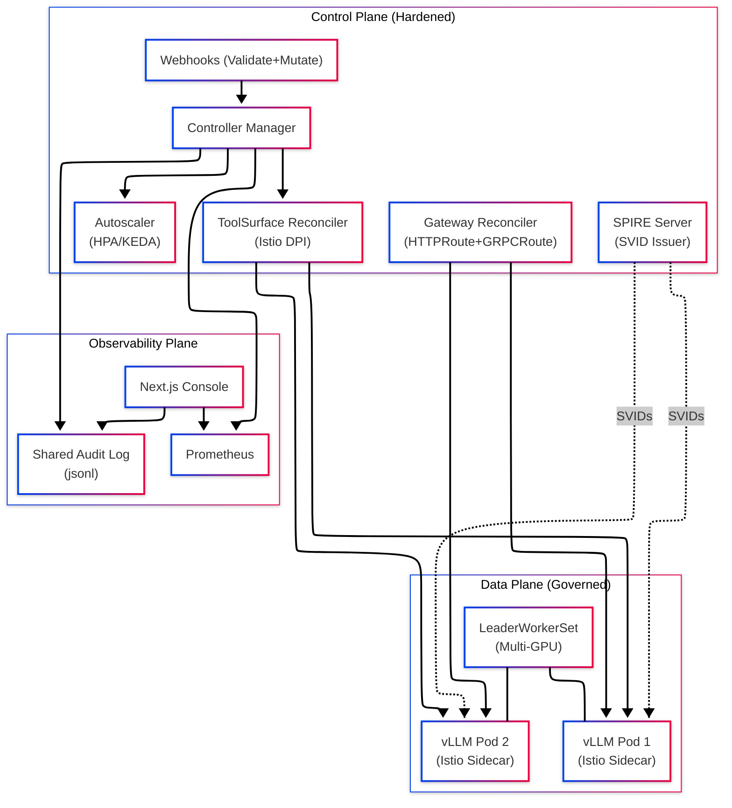

# CKodex KServe LLM Operator

[](https://goreportcard.com/report/github.com/ckodex-labs/ckodex-kserve-llm)
[](https://opensource.org/licenses/Apache-2.0)
[](docs/getting-started.md)
[](https://securityscorecards.dev/viewer/?uri=github.com/ckodex-labs/ckodex-kserve-llm)

An opinionated Kubernetes operator for managing LLM inference workloads. Built on KServe v0.17+ architecture with the V2 Open Inference Protocol, Gateway API (HTTPRoute + GRPCRoute), and comprehensive platform features.

- **[Component Version Inventory](COMPONENTS.md)**: Track exact versions of vLLM, SPIRE, Gatekeeper, and other orchestrated components.

## Architecture



> [!NOTE]
> For a deep dive into our defense-in-depth strategy, mTLS enforcement, and OPA policy layers, see the **[Security Architecture](docs/SECURITY_ARCHITECTURE.md)** guide.

## Production Hardening Features

### Governed State Planes (L|T|R)

The operator implements a **Governed Composite State Machine** that aggregates safety and compliance metadata across the model system:

- **Lifecycle (L)**: `pending` → `active` → `quarantined`. Tracks the operational readiness of the model.
- **Trust (T)**: `unknown` → `asserted` → `verified`. Most runtime paths are currently **asserted** by default; `verified` should only be treated as true when the controller records cryptographic evidence rather than placeholder or inferred status.
- **Risk (R)**: `normal` → `evaluating` → `high`. Real-time risk assessment based on behavioral declared intent and tool usage.

### Deep Packet Inspection (DPI)

Models requiring external tool access (`ToolSurface.AllowedAPIs`) are isolated via **Istio Egress Filtering**:

- Automatic `ServiceEntry` and `VirtualService` generation for FQDN targets.
- Sidecar-level egress isolation prevents unauthorized data exfiltration.
- Contributes network-isolation evidence, but does not by itself prove software provenance.

### Real-time Monitoring Console

A built-in Next.js dashboard provides a unified view of the governed fleet:

- **Lattice Visualization**: Real-time status of `L|T|R` state planes for every model.
- **Live Audit Feed**: Event-driven streaming of operator and inference decisions.
- **Shared Audit Plane**: Uses a high-performance persistent volume for real-time log ingestion.

### Evidence Hooks

The repository ships machine-readable evidence hooks, but not every runtime path is cryptographically verified today:

- **OSCAL Assessment**: Automated validation of NIST 800-53 controls (SR-2, SI-4, SI-7) exported to **`assessment-results.yaml`**.
- **OIS Signal Payloads**: Standardized inference behavior telemetry using **Open Inference Signals v0.1**.
- **Supply-Chain Artifacts**: The tag-driven release workflow publishes Cosign signatures, SBOMs, and provenance artifacts. Runtime controllers only report `verified` when a cryptographic verification result has actually been recorded.

See **[COMPLIANCE.md](COMPLIANCE.md)** for the full control mapping.

## Operational Guides

...

Comprehensive documentation for the lifecycle of models, tenants, and agents:

- **[Model Onboarding Guide](docs/onboarding-guide.md)**: From binary acquisition to production promotion.
- **[Model Offboarding Guide](docs/offboarding-guide.md)**: Graceful shutdown and finalizer cleanup.
- **[Tenant Onboarding Guide](docs/tenant-onboarding.md)**: Multi-tenancy, compliance silos, and isolation.
- **[Agent Development Guide](docs/agent-development.md)**: Using the Agent and SkillRegistry system.

## CRDs

| CRD                         | Purpose                                                       |
| --------------------------- | ------------------------------------------------------------- |
| `LLMInferenceService`       | Core workload: model, replicas, parallelism, scaling, routing |
| `LLMInferenceServiceConfig` | Reusable config templates                                     |
| `EndpointPickerConfig`      | KV-cache scheduler plugin pipeline                            |
| `AgentSpec`                 | AI agent with model bindings and tools                        |
| `SkillRegistry`             | Versioned skill catalog                                       |
| `ModelOnboarding`           | Declarative model lifecycle pipeline                          |

## Quick Start

> [!IMPORTANT]
> For a clean installation on a fresh KIND cluster, use the repo-native wrapper
> scripts in `run/` and the lower-level building blocks in `local/`.

### 1. Setup KIND cluster

```bash
./run/e2e.sh
```

### 2. What it does

The wrapper installs cert-manager, Gateway API, Envoy Gateway, MetalLB, the
HuggingFace CSI driver, CRDs, and the controller, then probes the sample
`LLMInferenceService`.

### 3. Verify your local environment with the Dagger pipeline

```bash
dagger call test --source=.
```

This command expects a working local Docker daemon. If Docker or the Dagger engine cannot start, treat that as an environment prerequisite failure rather than proof that the repository is release-ready.

### 4. Verify

```bash
kubectl get pods -n ckodex-system
```

### 5. Tear down the local cluster

```bash
./run/cleanup.sh
```

## High-Assurance CI/CD (Dagger)

The Dagger-powered pipeline is the repo-level validation path for lint, tests, scans, SBOM generation, and Lula/OSCAL export. Local runs are useful for preflight checks, but the tag-driven release workflow remains the authoritative path for release signing and hosted provenance:

- Linting
- Security scanning
- SBOM generation
- OSCAL evidence export

## Releases

The repo exposes two release checks:

- `make release-readiness` for a local snapshot rehearsal of binary archives, checksums, and the Helm package
- the tag-driven GitHub Actions workflow for published images, draft release assets, and hosted provenance

On a successful tagged release, GitHub Actions is configured to publish:

- versioned binaries,
- cosign-signed container images,
- draft GitHub release assets for review,
- and provenance artifacts for downstream verification.

Treat the presence of those artifacts as a release input, not as an automatic public-readiness verdict.

See [docs/release-verification.md](docs/release-verification.md) for the local rehearsal contract and downstream verification commands.

## Gemma 4 Notes

Gemma 4 tuning in this repo is environment-dependent. Use the deployment guide and performance note as operator guidance, not as CI-backed benchmark evidence:

- [docs/gemma4-deployment-guide.md](docs/gemma4-deployment-guide.md)
- [docs/GEMMA_4_PERFORMANCE_REPORT.md](docs/GEMMA_4_PERFORMANCE_REPORT.md)

## Features

### V2 Open Inference Protocol

- Full HTTP REST + gRPC compliance
- Binary Tensor Data Extension (zero-copy)
- OpenAI-compatible `/v1/chat/completions` + `/v1/embeddings`

### Gateway API

- HTTPRoute: V2 paths, OpenAI, embeddings
- GRPCRoute: All 6 GRPCInferenceService RPCs
- Envoy AI Gateway token rate limiting

### Distributed Inference

- LeaderWorkerSet for multi-node GPU topology
- Tensor/Data/Expert parallelism
- Disaggregated prefill-decode

### Autoscaling

- HPA (CPU/custom metrics)
- KEDA ScaledObject (scale-to-zero)
- WVA (Workload Variant Autoscaler)

### Security

- Native SPIFFE/SPIRE (Server + Agent)
- Vault integration
- OPA/Gatekeeper policies
- Default-deny NetworkPolicies

### Model Management

- OCI model distribution (`oci://` via ORAS)
- Model onboarding pipeline with promotion gates
- Agent & skill registry
- **Local Model Caching**: LRU-based eviction, warmup jobs, and source model hashing.
- **Well-Known Model Registry**: Optimized defaults for `Llama-3.1`, `Mistral-7B`, and `Gemma-4`.
- **TurboQuant Integration**: Support for 6x KV cache compression for long-context (128k+) stability.
- **Strict Admission Control**: Power-of-2 parallelism enforcement and Guaranteed QoS for GPU workloads.
- **LocalModelCache**: Zero-copy model loading via node-local storage and hostPath mounts.

### Experimental Feature Gates

Some features are in Active Development and require explicit opt-in via Helm `features.*` or `CKODEX_FEATURE_*` environment variables.

| Feature Gate | Default | Subsystems Enabled | Stability |
| :--- | :--- | :--- | :--- |
| `EnableExperimentalAgents` | `false` | `Agent`, `SkillRegistry` controllers | ALPHA |
| `EnableExperimentalHardwareSelection` | `false` | Multi-arch image tag mapping | ALPHA |
| `EnableExperimentalStatusHardening` | `false` | Atomic DeploymentReady checks | BETA |
| `EnableSecurity` | `false` | SPIRE, eBPF, OPA, Vault | BETA |

### Production Hardening

- **SSDLC Enforcement**: Zero-tolerance for unchecked errors, weak crypto, and variable shadowing via strict golangci-lint profile.
- **Release Provenance**: The tag-driven release workflow generates OIDC-backed provenance artifacts and release attestations.
- **Guaranteed QoS**: Automatic alignment of CPU/Memory requests and limits for stable scheduling.
- **Graceful Termination**: 30-second default termination grace period for all inference workloads.
- **Atomic Reconciliation**: High-performance status updates using SSA-style Patching with DeepEqual guards.
- **Deterministic Lifecycles**: Strict finalizer-first ordering to prevent resource leaks.

### Observability

- **Lifecycle Events**: Native Kubernetes Event emission for all major transitions (Deployment creation, LoRA loading, Cache eviction).
- **Prometheus Metrics**: Promotion gates require a configured Prometheus backend unless an explicit insecure compatibility fallback is enabled for development.
- **Auditability**: Track operator decisions via `kubectl get events`.

## Development

```bash
make generate      # Generate DeepCopy + CRDs
make build         # Build binary
make test          # Run tests (≥80% coverage)
make lint          # golangci-lint
make console-check # Build the console production bundle
make docker-build  # Build container
```

## Contributing

We welcome contributions! To ensure the project remains "Hardened" and production-ready, all PRs must adhere to our **Supply-Chain & Compliance-as-Code** requirements:

- **Signed Commits**: All commits must be signed (DCO).
- **Compliance Evidence**: New security features must include a corresponding **Lula Validation**.
- **OIS Instrumentation**: New telemetry must follow the **Open Inference Signals v0.1** spec.

See **[CONTRIBUTING.md](CONTRIBUTING.md)** for the full developer workflow.

## Benchmarks

```bash
# Run k6 performance benchmarks
k6 run --env BASE_URL=http://localhost:8080 test/benchmark/k6_benchmark.js
```

## License

Apache License 2.0
