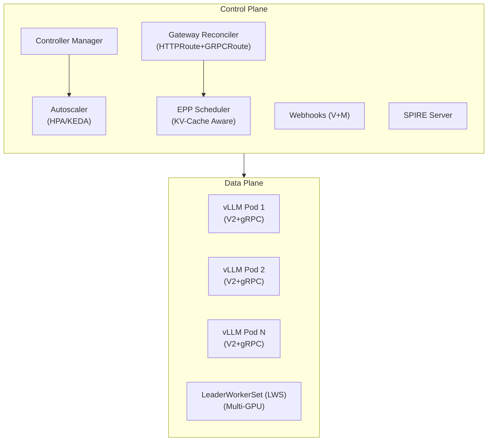

# CKodex KServe LLM Operator

A production-grade Kubernetes operator for managing LLM inference workloads. Built on KServe v0.17 architecture with the V2 Open Inference Protocol, Gateway API (HTTPRoute + GRPCRoute), and comprehensive platform features.

## Architecture



## Operational Guides

Comprehensive documentation for the lifecycle of models, tenants, and agents:

- **[Model Onboarding Guide](docs/onboarding-guide.md)**: From binary acquisition to production promotion.
- **[Model Offboarding Guide](docs/offboarding-guide.md)**: Graceful shutdown and finalizer cleanup.
- **[Tenant Onboarding Guide](docs/tenant-onboarding.md)**: Multi-tenancy, compliance silos, and isolation.
- **[Agent Development Guide](docs/agent-development.md)**: Using the Agent and SkillRegistry system.

## CRDs

| CRD                         | Purpose                                                       |
| --------------------------- | ------------------------------------------------------------- |
| `LLMInferenceService`       | Core workload: model, replicas, parallelism, scaling, routing |
| `LLMInferenceServiceConfig` | Reusable config templates                                     |
| `EndpointPickerConfig`      | KV-cache scheduler plugin pipeline                            |
| `AgentSpec`                 | AI agent with model bindings and tools                        |
| `SkillRegistry`             | Versioned skill catalog                                       |
| `ModelOnboarding`           | Declarative model lifecycle pipeline                          |

## Quick Start

```bash
# Install CRDs
kubectl apply -f config/crd/

# Deploy operator
kubectl apply -f config/manager/

# Create an inference service
kubectl apply -f config/samples/llminferenceservice_basic.yaml

# Verify
kubectl get llminferenceservice
kubectl get pods -l app.kubernetes.io/name=llminferenceservice
```

## Features

### V2 Open Inference Protocol
- Full HTTP REST + gRPC compliance
- Binary Tensor Data Extension (zero-copy)
- OpenAI-compatible `/v1/chat/completions` + `/v1/embeddings`

### Gateway API
- HTTPRoute: V2 paths, OpenAI, embeddings
- GRPCRoute: All 6 GRPCInferenceService RPCs
- Envoy AI Gateway token rate limiting

### Distributed Inference
- LeaderWorkerSet for multi-node GPU topology
- Tensor/Data/Expert parallelism
- Disaggregated prefill-decode

### Autoscaling
- HPA (CPU/custom metrics)
- KEDA ScaledObject (scale-to-zero)
- WVA (Workload Variant Autoscaler)

### Security
- Native SPIFFE/SPIRE (Server + Agent)
- Vault integration
- OPA/Gatekeeper policies
- Default-deny NetworkPolicies

### Model Management
- OCI model distribution (`oci://` via ORAS)
- Model onboarding pipeline with promotion gates
- Agent & skill registry
- **Local Model Caching**: LRU-based eviction, warmup jobs, and source model hashing.

### Production Hardening
- **Guaranteed QoS**: Automatic alignment of CPU/Memory requests and limits for stable scheduling.
- **Graceful Termination**: 30-second default termination grace period for all inference workloads.
- **Atomic Reconciliation**: High-performance status updates using SSA-style Patching with DeepEqual guards.
- **Deterministic Lifecycles**: Strict finalizer-first ordering to prevent resource leaks.

### Observability
- **Lifecycle Events**: Native Kubernetes Event emission for all major transitions (Deployment creation, LoRA loading, Cache eviction).
- **Prometheus Metrics**: Built-in scrapers for inference success rates and P99 latency.
- **Auditability**: Track operator decisions via `kubectl get events`.

## Development

```bash
make generate      # Generate DeepCopy + CRDs
make build         # Build binary
make test          # Run tests (≥80% coverage)
make lint          # golangci-lint
make docker-build  # Build container
```

## Benchmarks

```bash
# Run k6 performance benchmarks
k6 run --env BASE_URL=http://localhost:8080 test/benchmark/k6_benchmark.js
```

## License

Apache License 2.0
