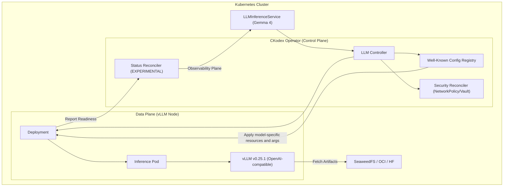

# Gemma 4 Operator Notes

This document summarizes the Gemma 4 operator wiring currently present in the repo. It is not a release benchmark report and should not be treated as independently reproduced performance evidence.

## System Architecture

The following diagram illustrates the high-assurance serving stack for Gemma 4, highlighting the integrated hardening layers.

## Performance Evidence

No latency, throughput, or VRAM benchmark is asserted by this repository. The
Well-Known profiles provide scheduling requests and runtime arguments only.
Measure the selected model, quantization, image digest, GPU, driver, and context
length together before setting capacity or SLOs.

### Notes

1. **NVFP4 runtime**: The default is vLLM v0.25.1 because its patch release includes a mixed-dtype Gemma/Qwen NVFP4 correctness fix.
2. **Environment Dependence**: Real latency and VRAM behavior depend on the runtime image, hardware tier, model variant, and cluster tuning.
3. **Status Hardening**: With `CKODEX_FEATURE_ENABLE_EXPERIMENTAL_STATUS_HARDENING` active, the operator provides the `DeploymentReady` condition for stronger rollout signaling.

## Hardening Details

- **Atomic Reconciliation**: All status updates use Optimistic Concurrency Control (CAS) with ResourceVersion integrity checks.
- **Supply Chain Security**: Runtime images must come from the configured allowlist, and `verified` provenance status only applies when signature, provenance, and SBOM attestation checks have been recorded successfully.
- **Resource Isolation**: NetworkPolicies are automatically provisioned to isolate egress from the ToolSurface.

Treat this file as implementation guidance, not as audited benchmark evidence.
