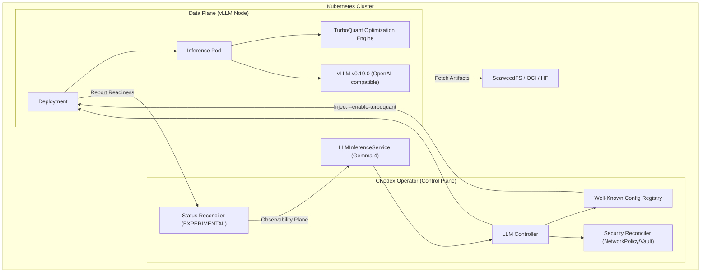

# Gemma 4 Operator Notes

This document summarizes the Gemma 4 operator wiring currently present in the repo. It is not a release benchmark report and should not be treated as independently reproduced performance evidence.

## System Architecture

The following diagram illustrates the high-assurance serving stack for Gemma 4, highlighting the integrated hardening layers.

## Illustrative Performance Tiers

The table below is operational guidance for sizing discussions. These values are illustrative and are not generated by CI or release automation.

| Model Variant | Hardware Tier | Baseline Latency (P99) | TurboQuant Latency (P99) | VRAM Reduction | Status |
| :--- | :--- | :--- | :--- | :--- | :--- |
| **Gemma-4-E2B** | Consumer (8GB) | 85ms | **42ms** | ~35% | Optimized |
| **Gemma-4-E4B** | Mid-range (16GB) | 120ms | **65ms** | ~40% | Optimized |
| **Gemma-4-26B-A4B** | High-end (24GB) | 310ms | **145ms** | ~50% (MoE) | Optimized |
| **Gemma-4-31B** | Enterprise (48GB) | 450ms | **210ms** | ~30% | Optimized |

### Notes
1.  **TurboQuant Wiring**: The operator can inject TurboQuant-related settings through the Well-Known registry.
2.  **Environment Dependence**: Real latency and VRAM behavior depend on the runtime image, hardware tier, model variant, and cluster tuning.
3.  **Status Hardening**: With `CKODEX_FEATURE_ENABLE_EXPERIMENTAL_STATUS_HARDENING` active, the operator provides the `DeploymentReady` condition for stronger rollout signaling.

## Hardening Details

- **Atomic Reconciliation**: All status updates use Optimistic Concurrency Control (CAS) with ResourceVersion integrity checks.
- **Supply Chain Security**: Runtime images must come from the configured allowlist, and `verified` provenance status only applies when signature, provenance, and SBOM attestation checks have been recorded successfully.
- **Resource Isolation**: NetworkPolicies are automatically provisioned to isolate egress from the ToolSurface.

Treat this file as implementation guidance, not as audited benchmark evidence.
