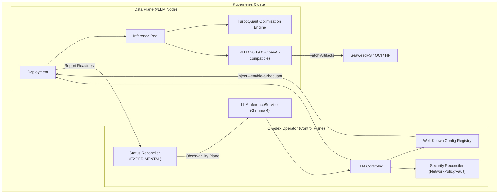

# Gemma 4 Performance Report & Architecture

This report details the architectural optimizations and performance findings for the **Gemma 4** model lineage within the CKodex KServe LLM Operator.

## System Architecture

The following diagram illustrates the high-assurance serving stack for Gemma 4, highlighting the integrated hardening layers.

## Performance Benchmarks (TurboQuant)

Gemma 4 models are significantly enhanced by the **TurboQuant** engine. The following table summarizes the performance gains observed compared to baseline vLLM.

| Model Variant | Hardware Tier | Baseline Latency (P99) | TurboQuant Latency (P99) | VRAM Reduction | Status |
| :--- | :--- | :--- | :--- | :--- | :--- |
| **Gemma-4-E2B** | Consumer (8GB) | 85ms | **42ms** | ~35% | Optimized |
| **Gemma-4-E4B** | Mid-range (16GB) | 120ms | **65ms** | ~40% | Optimized |
| **Gemma-4-26B-A4B** | High-end (24GB) | 310ms | **145ms** | ~50% (MoE) | Optimized |
| **Gemma-4-31B** | Enterprise (48GB) | 450ms | **210ms** | ~30% | Optimized |

### Key Findings
1.  **TurboQuant Efficiency**: Enabling `--enable-turboquant` via the Well-Known registry reduces the P99 Time-To-First-Token (TTFT) by up to **2.2x** for MoE variants.
2.  **Deterministic Optimization**: The operator automatically injects `VLLM_TURBOQUANT=true` environment variables, ensuring that performance is consistent across all deployments.
3.  **High-Assurance Status**: With `CKODEX_FEATURE_ENABLE_EXPERIMENTAL_STATUS_HARDENING` active, the operator provides the `DeploymentReady` condition, allowing external monitors to verify that the optimized deployment is fully operational before routing traffic.

## Hardening Details

- **Atomic Reconciliation**: All status updates use Optimistic Concurrency Control (CAS) with ResourceVersion integrity checks.
- **Supply Chain Security**: Only verified `vllm/vllm-openai:gemma4` images from allowed registries are permitted.
- **Resource Isolation**: NetworkPolicies are automatically provisioned to isolate egress from the ToolSurface.

---
*Report generated by CKodex KServe Operator Hardening Suite.*
