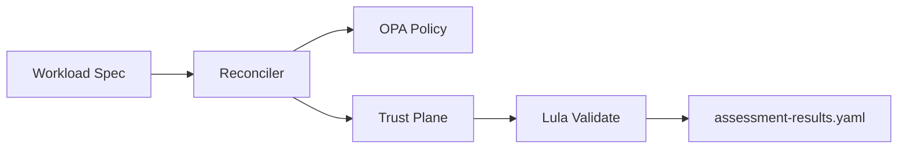

# Security Architecture: The Governed Trust Loop

The **ckodex-kserve-llm** operator implements a "Governed Trust Loop" to ensure that AI workloads are deployed in a zero-trust environment with automated compliance evidence.

## 1. Zero-Trust Foundations

The architecture is built on three pillars of security: **Identity**, **Isolation**, and **Integrity**.

### A. Workload Identity (SPIFFE/SPIRE)
Every inference service is issued a unique **SPIFFE ID** based on its Kubernetes ServiceAccount and Model name.
- **Identity Issuance**: The `SPIREReconciler` manages a node-local SPIRE Agent.
- **mTLS Enforcement**: Workloads obtain SVIDs via the SPIFFE Workload API (CSI driver), enabling cryptographically verified mTLS for all backend communication.
- **NIST Mapping**: **IA-9** (Service Identification and Authentication) — applies to non-person entities (workload SVIDs), not IA-2 which governs organizational user accounts.

### B. Traffic Isolation (Istio DPI)
The operator automatically generates Istio `ServiceEntry` and `VirtualService` resources for workloads that declare behavioral intent via the `ToolSurface`.
- **Egress Filtering**: Deep Packet Inspection (DPI) ensures that model tools can only reach authorized FQDN targets.
- **Default Deny**: All model pods are isolated by default via Kubernetes `NetworkPolicies` until their traffic profile is explicitly reconciled.
- **NIST Mapping**: **AC-4** (Information Flow Enforcement) — egress filtering and default-deny NetworkPolicies enforce information flow policy at the pod level.

### C. Resource Integrity (OPA Gatekeeper)
Policies are enforced at admission time using **OPA Gatekeeper**.
- **GPU Quotas**: Prevent resource exhaustion and GPU exfiltration.
- **Image Allowlist**: Ensure only trusted, signed registries (`ckodex`, `vllm`, `kserve`) are used for inference runtimes.

## 2. The L|T|R Governance Model

Compliance is tracked via a composite state machine represented as three "State Planes":

| Plane | State | Trigger | NIST 800-53 Mapping |
| :--- | :--- | :--- | :--- |
| **Lifecycle (L)** | `active` | Successful deployment and continuous health checks pass. | **CA-7** (Continuous Monitoring) |
| **Trust (T)** | `asserted` → `verified` | `verified` requires a runtime record of successful signature, provenance, and SBOM attestation checks. | **SI-7** (Software & Information Integrity), **SR-4** (Provenance) |
| **Risk (R)** | `normal` | Real-time analysis of OIS behavioral signals. | **SI-4** (System Monitoring) |

## 3. Evidence-as-Code (OSCAL)

Unlike typical systems which provide "hand-wavy" security claims, this operator generates machine-readable **OSCAL Assessment Results**.



### Technical Proof: OSCAL Evidence
The following snippet is an actual assessment result for **SI-7 (Software Integrity)**:

```yaml
# oscal-assessment-results.yaml (Snippet — SI-7 observation)
observations:
  - uuid: 66666666-6666-4666-8666-666666666661
    title: "Software Supply Chain Integrity"
    description: >-
      Passes only when the controller has recorded a runtime verification result
      for signature, provenance, and SBOM attestation on the assessed workload.
    methods:
      - EXAMINE
    subjects:
      - subject-uuid: 77777777-7777-4777-8777-777777777771
        type: component
        title: "LLMInferenceService/gemma-4-e2b"
        links:
          - href: "kubernetes://namespaces/default/llminferenceservices/gemma-4-e2b"
            rel: reference
    relevant-evidence:
      - description: "status.conditions[Compliance-SI-7].status == True"
        href: "kubernetes://namespaces/default/llminferenceservices/gemma-4-e2b"
        remarks: "condition.reason must equal ProvenanceVerified"
```

## 4. Open Inference Signals (OIS) v0.1

Behavioral monitoring is standardized via **OIS v0.1**. The data plane emits structured telemetry that the operator uses to dynamically adjust the **Risk (R)** plane.

### Technical Proof: OIS Metric Signal
```json
{
  "ois.v0.1.signal": "InferenceMetric",
  "timestamp": "2026-04-11T02:45:30Z",
  "resource.name": "gemma-4-e2b",
  "metric.name": "p99_latency_ms",
  "metric.value": 42.0,
  "context.tenant": "finance-alpha"
}
```
