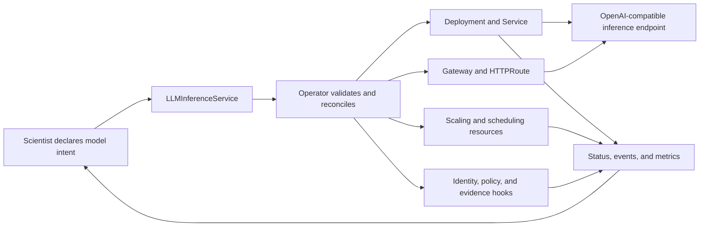

# CKodex KServe LLM Operator: Big Picture

## One-Sentence Explanation

The CKodex KServe LLM Operator turns a model-serving declaration into
Kubernetes workloads, routing, scaling, identity, and observable status while
keeping platform policy in the reconciliation loop.

It does not train models. It does not replace KServe, Kubernetes, vLLM, or a
model evaluation framework. It coordinates those runtime concerns around a
small set of custom resources.

## Who Does What

| Actor | Owns | Primary interface |
|---|---|---|
| Model scientist | Model choice, artifact URI, runtime requirements, acceptance criteria | `LLMInferenceService` manifest and inference endpoint |
| Platform developer | Cluster, GPU/runtime stack, storage credentials, Gateway API, metrics, feature gates | Helm/Kustomize, operator configuration, Dagger |
| Operator | Reconciliation from desired state to Kubernetes resources and status | Controllers and status conditions |
| Security or compliance reviewer | Workload identity, network policy, release evidence, OSCAL results | Kubernetes resources, release artifacts, Lula assessment |

The scientist should not need to understand controller internals. The platform
developer should not need to rewrite model-serving logic for each model.

## The Core Loop



The API object is the contract. The generated Kubernetes resources are the
implementation. Status, events, metrics, and evidence are the feedback.

## End-to-End Journey

1. **Plan capacity.** Determine whether the model fits the target hardware.
   `./run/capacity-plan.sh` provides static planning for the large models
   covered by this repository.
2. **Make the artifact reachable.** Use a supported model URI such as
   `hf://`, `hf-mount://`, `oci://`, `s3://`, or `pvc://`, with credentials
   supplied through Kubernetes references.
3. **Declare serving intent.** Create a stable
   `serving.ckodex.com/v1` `LLMInferenceService`.
4. **Reconcile runtime resources.** The operator creates or updates the model
   Deployment, Service, route, scheduler, and optional policy resources.
5. **Observe readiness.** Read the custom resource status, Kubernetes events,
   workload status, and Prometheus metrics. A created object is not the same as
   a ready model.
6. **Call the endpoint.** Clients use the model name declared in
   `spec.model.name` through the OpenAI-compatible HTTP API.
7. **Promote deliberately.** `ModelOnboarding` can sequence readiness and
   Prometheus-backed gates. Traffic weights remain controlled by
   `LLMInferenceService.spec.canary` and Gateway reconciliation.
8. **Verify the delivery path.** Dagger runs repository checks. Tagged release
   workflows publish the release artifacts and provenance used for downstream
   verification.

## What Is Available Today

### Core Runtime

- `LLMInferenceService` manages model-serving desired state.
- HTTP routing uses Gateway API resources.
- Scaling and scheduler resources are reconciled when enabled.
- Specialized CRDs cover embeddings, ASR, multimodal inference, reranking,
  LoRA adapters, evaluation profiles, sessions, and artifact packs.
- `ModelOnboarding` sequences readiness and metrics-backed gates.

### Optional or Environment-Dependent

- SPIFFE/SPIRE, policy, auth, sessions, webhooks, and several observability
  paths require feature gates and external cluster dependencies.
- GPU execution requires compatible nodes, drivers, runtime classes, and model
  images.
- Live Lula assessment requires Kubernetes credentials. Offline policy fixtures
  only prove policy behavior against test resources.

### Experimental Boundary

- `Agent` and `SkillRegistry` controllers are disabled by default.
- They validate model and skill references and publish readiness status.
- They do not currently deploy an agent runtime, intercept tool calls, or
  execute skill endpoints.

## Resource Map

| Need | Resource |
|---|---|
| Serve a chat/completion model | `LLMInferenceService` |
| Serve embeddings, ASR, multimodal, or reranking | Specialized inference CRD |
| Pre-stage model weights | `LocalModelCache` |
| Load a LoRA adapter | `LLMLoraAdapter` |
| Describe governed AI artifacts | `AIPack` |
| Sequence model readiness and metric gates | `ModelOnboarding` |
| Describe an experimental agent binding | `Agent` |
| Catalog experimental skill metadata | `SkillRegistry` |

Stable `serving.ckodex.com/v1` APIs exist for `LLMInferenceService`,
`LLMLoraAdapter`, `Agent`, `SkillRegistry`, `ModelOnboarding`, sessions, and
coactor resources. Specialized inference, cache, evaluation, and AIPack
resources remain `serving.ckodex.com/v1alpha2`.

## Success Signals

For a model scientist:

- The `LLMInferenceService` reports ready.
- The model Deployment has ready replicas.
- The declared model name answers through the HTTP endpoint.
- Latency, errors, and token metrics are visible for evaluation.

For a platform developer:

- Reconciliation is repeatable after restart or spec change.
- Required Gateway, policy, identity, and scaling resources exist.
- `dagger call all --source=.` and the required extended gates pass.
- Release artifacts can be verified downstream.

## Current Boundaries

- The local KIND path proves a small CPU-capable model, not GPU capacity or
  performance for larger models.
- A `ModelOnboarding` canary stage currently checks ready replicas. It does not
  mutate route weights.
- A promotion stage checks model readiness. Route promotion remains a separate
  desired-state change.
- Security status is evidence only when backed by the corresponding runtime or
  release artifact. A status label alone is not cryptographic proof.
- Public release metadata and API stability are separate: the chart currently
  uses beta versioning even though several core CRDs have a stable v1 storage
  version.
- The local E2E manifest uses the stable `LLMInferenceService` v1 API and the
  signed `hf://` storage-initializer path. The optional `hf-mount://` profile
  requires the separately installed Hugging Face CSI/FUSE driver; alpha-only
  fields remain outside the stable v1 contract.

## Documentation Map

| Goal | Start here |
|---|---|
| Understand the system | This document |
| Run the local proof | [Getting Started](getting-started.md) |
| Onboard a model | [Model Onboarding](onboarding-guide.md) |
| Plan hardware | [Model Capacity](model-capacity.md) |
| Configure tenants | [Tenant Onboarding](tenant-onboarding.md) |
| Understand experimental agents | [Agent Development](agent-development.md) |
| Operate and troubleshoot | [Runbooks](runbooks/model-deployment.md) |
| Understand security controls | [Security Architecture](SECURITY_ARCHITECTURE.md) |
| Verify CI and releases | [CI State](ci/current-state.md) and [Release Verification](release-verification.md) |

## Context Capsule for Another AI

Use this block as the minimum repository context:

```text
Project: CKodex KServe LLM Operator
Purpose: Reconcile model-serving intent into Kubernetes runtime resources and status.
Primary stable API: serving.ckodex.com/v1 LLMInferenceService.
Extended APIs: several specialized resources remain serving.ckodex.com/v1alpha2.
Primary users: model scientists declare models; platform developers operate the cluster.
Core outputs: Deployment, Service, Gateway/HTTPRoute, scaling/scheduling resources,
optional identity/policy resources, status, events, metrics, and release evidence.
Local proof: ./run/e2e.sh
Repository gate: dagger call all --source=.
Extended test gate: dagger call test --source=.
Important boundary: Agent and SkillRegistry validate metadata references only;
they are not an agent execution or tool-calling runtime.
Important boundary: ModelOnboarding checks readiness and metrics; traffic weights
are controlled separately by LLMInferenceService canary configuration.
Source of truth: api/v1alpha2, internal/controller, cmd/manager/,
config/samples, dagger/module.go, dagger/policy.go, dagger/build.go.
```
